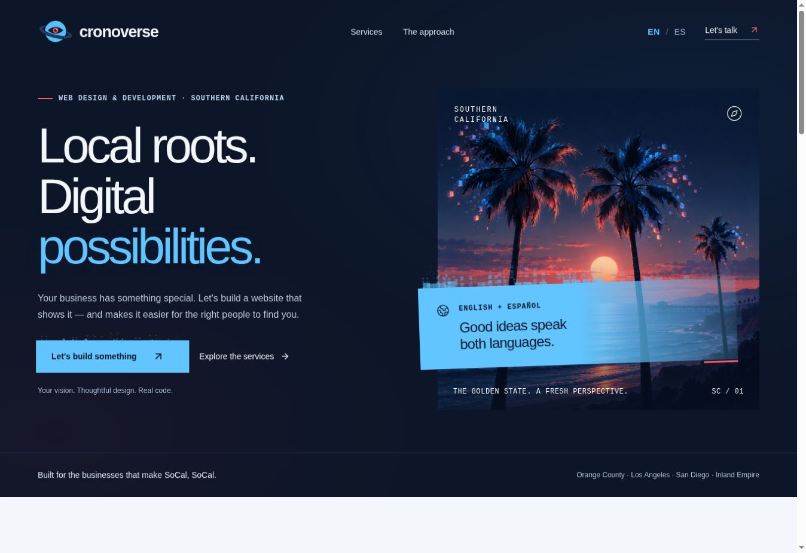

# Cronoverse Web Studio

Bilingual web design and development studio website for Southern California.
Contains the approved frontend, original artwork, interactive examples, and the
initial project-inquiry backend.

## Current experience

- English/Spanish content and saved language preference.
- Digital SoCal sunset hero, particle accents, and reduced-motion support.
- Approved Saturn-eye icon: blue planet, red iris, dark navy ring.
- Interactive inventory, landing page, business profile, order grid, and charts.
- Inquiry form with server validation and Cloudflare D1 storage.

The carousel uses sample data and component state. It does not create real
products, orders, sales, or appointments.



## Stack

React 19, TypeScript, Vinext/Vite with Next.js-style App Router routes, Tailwind,
Shadcn components, Embla, Recharts, Cloudflare Workers, D1, and Drizzle.
Use the package scripts, not `next dev`.

## Run locally

Requirements: Node.js 22.13+ and pnpm 11.25.0 (pinned in `package.json`).

```sh
git clone https://github.com/crono117/cronoverse_web_studio.git
cd cronoverse_web_studio
corepack enable
corepack pnpm install --frozen-lockfile
corepack pnpm db:migrate:local
corepack pnpm dev
```

Open the printed local URL, normally `http://localhost:5173`. Local development
requires no Cloudflare login, API keys, or production database access. Local D1
state lives in ignored `.wrangler/state` files.

Clean clones automatically select the portable execution profile. The optional
`.sites-runtime` configuration belongs to managed ChatGPT previews and is not
committed. The managed `install:ci` helper is not needed for a normal local clone.

## Checks and build

```sh
corepack pnpm typecheck
corepack pnpm build
corepack pnpm start
```

The build produces a Worker and assets under `dist/`. `start` runs that output
locally with Wrangler; use its printed URL. Apply local migrations before using
the inquiry form. Build output and local database files are not tracked.

## Backend starting point

`POST /api/inquiries` validates project inquiries and saves them to D1. It checks
Origin when provided, uses a honeypot, handles ordinary retries with a UUID, and
limits submissions per email address. There is no admin inbox, authenticated
inquiry-read endpoint, email delivery, or CRM integration yet.

Read [the backend handoff](docs/BACKEND_HANDOFF.md) for the request contract,
limitations, and proposed first backend milestone.

## Source map

| Path | Purpose |
| --- | --- |
| `app/page.tsx` | Landing page, translations, language selection, inquiry form |
| `app/globals.css` | Approved styling and responsive layouts |
| `components/capability-showcase.tsx` | Five interactive sample applications |
| `components/dust-surface.tsx` | Canvas particle accents |
| `app/api/inquiries/route.ts` | Public inquiry submission endpoint |
| `db/schema.ts`, `db/raw.ts` | Database schema and D1 access |
| `drizzle/` | Versioned database migrations |
| `wrangler.local.jsonc` | Local-only migration configuration |
| `public/hero-digital-palms.png` | Approved hero illustration |
| `public/cronoverse-saturn-eye-navy.png` | Navbar, footer, and favicon artwork |

## Hosting and provenance

The existing website is hosted through ChatGPT Sites. `.openai/hosting.json`
identifies that Site and its `DB` binding; it contains no secrets. GitHub pushes
**do not automatically deploy** the live website. No deployment workflow is
configured in this initial export.

The database ID in the local configuration is an emulator placeholder. Hosting
outside Sites requires a deliberate deployment configuration and real bindings.
`app/chatgpt-auth.ts` depends on trusted identity headers from Sites and is not
standalone production authentication.

This is a snapshot of approved Sites source commit
`3efc509ea500e4b215415844282e5f17ce8f113e`, plus setup documentation and local
commands. Production inquiry records, credentials, and local runtime state are
not included.

Requested domain: `cronoverse.online`. Preserve `xenos.cronoverse.online` and
existing mail records during future DNS work. See [ASSETS.md](ASSETS.md) for
artwork notes. Third-party license notices remain alongside vendored code.
