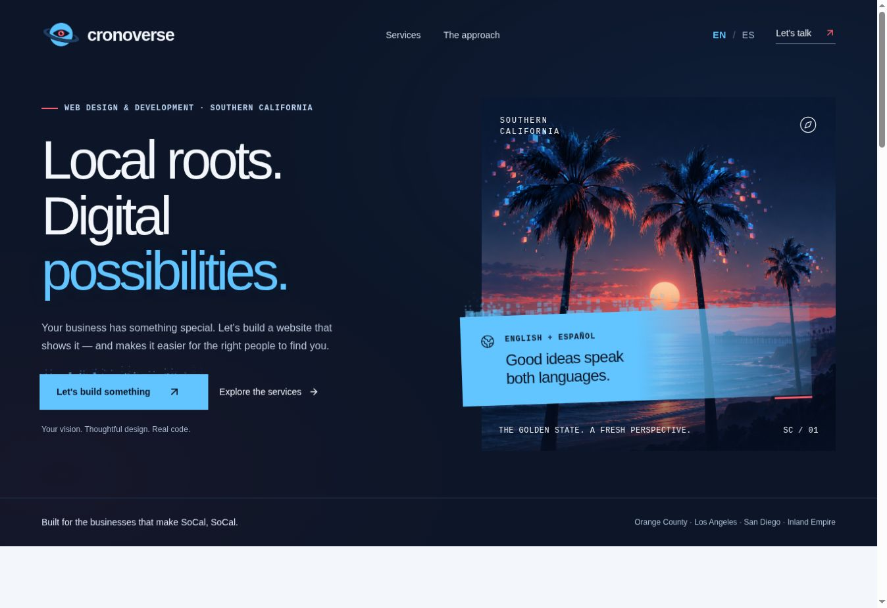

# Cronoverse Web Studio

Bilingual web design and development studio website for Southern California.
Contains the approved frontend, original artwork, interactive examples, and the
Django project-inquiry backend with SMTP emails and an admin inbox.

## Current experience

- English/Spanish content and saved language preference.
- Digital SoCal sunset hero, particle accents, and reduced-motion support.
- Approved Saturn-eye icon: blue planet, red iris, dark navy ring.
- Interactive inventory, landing page, business profile, order grid, and charts.
- Inquiry form with Django storage, English/Spanish welcome emails, owner notifications, and Django/Jazzmin admin.

The carousel uses sample data and component state. It does not create real
products, orders, sales, or appointments.



## Stack

React 19, TypeScript, Vinext/Vite with Next.js-style App Router routes, Tailwind,
Shadcn components, Embla, Recharts, and Cloudflare Workers for the frontend.
Django 5.2, Django REST Framework, Jazzmin, SMTP, and PostgreSQL (SQLite locally)
for inquiries. The legacy D1 schema and Drizzle files remain for historical data.
Use the package scripts, not `next dev`.

## Run locally

Requirements: Python 3.12+, Node.js 22.13+, and pnpm 11.25.0 (pinned in `package.json`).

```sh
git clone https://github.com/crono117/cronoverse_web_studio.git
cd cronoverse_web_studio
corepack enable
corepack pnpm install --frozen-lockfile
cp .dev.vars.example .dev.vars
corepack pnpm dev
```

Start Django and its email worker using [the backend setup](docs/DJANGO_BACKEND.md)
before submitting the form. Open the frontend's printed local URL, normally `http://localhost:5173`. Local development
requires no Cloudflare login or production database access. Development keys
and example mailboxes are provided for local testing only; emails print to the
worker terminal until SMTP is selected.

Clean clones automatically select the portable execution profile. The optional
`.sites-runtime` configuration belongs to managed ChatGPT previews and is not
committed. The managed `install:ci` helper is not needed for a normal local clone.

## Checks and build

```sh
corepack pnpm test:inquiries
corepack pnpm typecheck
corepack pnpm build
corepack pnpm start
```

The build produces a Worker and assets under `dist/`. `start` runs that output
locally with Wrangler; use its printed URL. Django database migrations are
required before using the inquiry form. Build output, credentials, and local
database files are not tracked.

## Inquiry backend

`POST /api/inquiries` validates and forwards inquiries to Django using a
server-only key. Django commits the inquiry and two email jobs together. The
email worker sends a welcome to the visitor and a notification to the configured
owner mailbox. SMTP failures preserve the inquiry and retry automatically.
Django/Jazzmin admin provides search, statuses, notes, and delivery/retry controls.

Read [the Django setup and deployment guide](docs/DJANGO_BACKEND.md). Live email
activation requires a Python host, SMTP credentials, an approved sender, the
owner's notification address, and the frontend's backend runtime settings.

## Source map

| Path | Purpose |
| --- | --- |
| `app/page.tsx` | Landing page, translations, language selection, inquiry form |
| `app/globals.css` | Approved styling and responsive layouts |
| `components/capability-showcase.tsx` | Five interactive sample applications |
| `components/dust-surface.tsx` | Canvas particle accents |
| `app/api/inquiries/route.ts`, `lib/inquiry-intake.ts` | Public inquiry endpoint and Django proxy |
| `backend/` | Django API, database migrations, SMTP worker, and admin |
| `db/schema.ts`, `db/raw.ts` | Legacy D1 schema/access; retained for historical data |
| `drizzle/` | Legacy D1 database migrations |
| `wrangler.local.jsonc` | Local-only migration configuration |
| `public/hero-digital-palms.png` | Approved hero illustration |
| `public/cronoverse-saturn-eye-navy.png` | Navbar, footer, and favicon artwork |

## Hosting and provenance

The existing website is hosted through ChatGPT Sites. `.openai/hosting.json`
identifies that Site and its `DB` binding; it contains no secrets. GitHub pushes
**do not automatically deploy** the live website. No deployment workflow is
configured. Source checks are provided by GitHub Actions.

The Django API and email worker run on a separate Python host. GitHub stores
the source but does not start that host or configure SMTP. The D1 database ID
in the local configuration is an emulator placeholder. Hosting
outside Sites requires a deliberate deployment configuration and real bindings.
`app/chatgpt-auth.ts` depends on trusted identity headers from Sites and is not
standalone production authentication.

This is a snapshot of approved Sites source commit
`3efc509ea500e4b215415844282e5f17ce8f113e`, plus setup documentation, local commands, and the Django backend integration. Production inquiry records, credentials, and local runtime state are
not included.

Requested domain: `cronoverse.online`. Preserve `xenos.cronoverse.online` and
existing mail records during future DNS work. See [ASSETS.md](ASSETS.md) for
artwork notes. Third-party license notices remain alongside vendored code.
