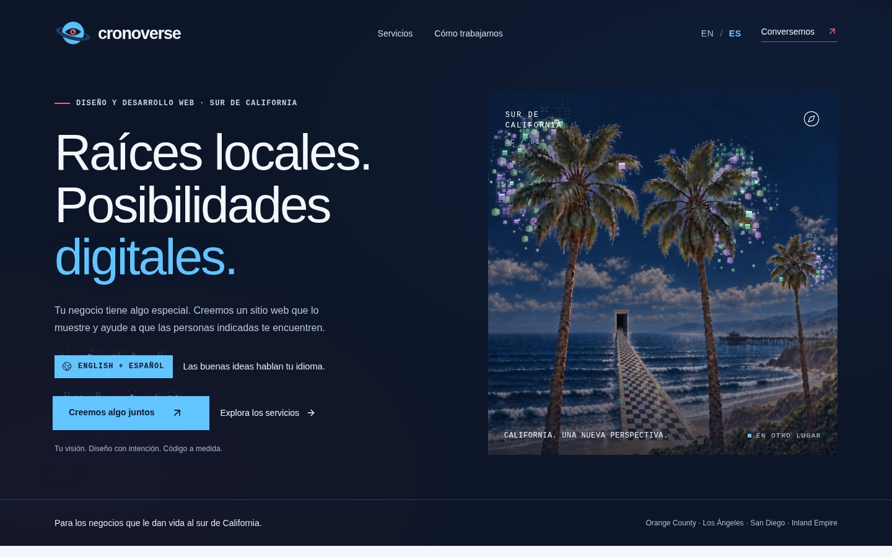
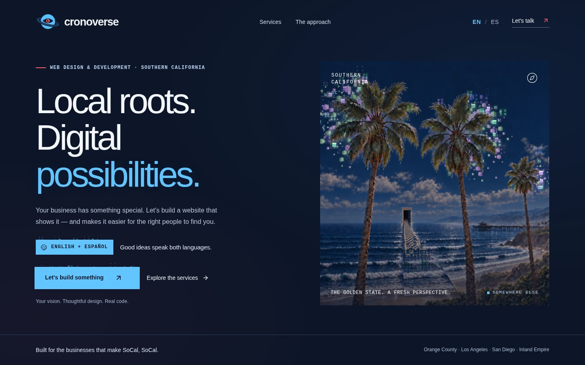
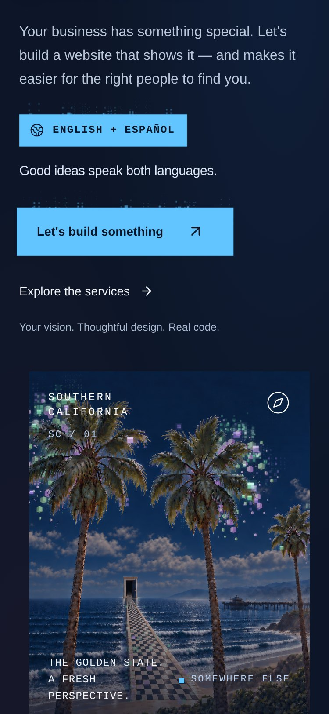
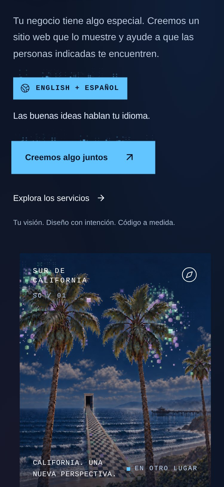

# Frontend and Django integration

`feat/frontend-django-integration` combines the approved animated frontend with
the dedicated Django backend. The visitor's English/Spanish form submits to this
site's own `/api/inquiries` server route, which validates the request and
forwards it to Django with a server-only shared key. Django stores the inquiry
and two email jobs in one transaction, and a separate worker sends the welcome
and owner emails. Google Analytics tracking loads only after the visitor consents.

This is source integration and local verification only. The live Site, DNS, a
Python host, and the Mailjet and Google credentials are unchanged and unconfigured.

## Provenance

| Piece | Source |
| --- | --- |
| Branch base, all of `backend/`, Mailjet worker, Jazzmin admin, GA4 reports | `origin/feat/django-backend` (`096955d`) |
| Animated hero, scene paintings, canvas engine, hero CSS and markup | `origin/feat/animated-palm-hero` (`ce08210`) |
| Proxy, tracking code, their tests, smoke script, env examples | `origin/feat/django-inquiry-emails`, pinned at `92fd91102b9beea73d3df088e4369842986766fc` |

The owner's checkout (`/home/crono/dev/crono_web_studio`) had no uncommitted
frontend work, only the untracked hero ZIP, and its tracked files matched
`origin/feat/animated-palm-hero` exactly. The ZIP is **older** than that branch:
its `lib/cronoverse-fumes.ts` and five scene PNGs are byte-identical, and its
`hero-scenes.tsx` and `page.tsx` differ only by a type cast and an unused import
that the branch had already fixed. The ZIP's `page.tsx` also lacks the tracking
hooks. The branch is therefore the latest approved animation, and the checkout was
left untouched as the recovery copy.

### What was taken

- **Hero:** `components/hero-scenes.tsx`, `lib/cronoverse-fumes.ts`,
  `public/hero-{sunny,night,predawn,rain,surreal}.png`, the hero CSS in
  `app/globals.css` (including removal of the old language sticker), the hero
  hunks of `app/page.tsx`, and the ESLint overrides for the canvas engine.
- **Proxy:** `lib/inquiry-intake.ts`, `app/api/inquiries/route.ts`,
  `tests/inquiry-proxy.test.mjs`, `scripts/smoke-inquiries.py`,
  `cloudflare-env.d.ts`, `.dev.vars.example`, `.env.example`.
- **Analytics:** `lib/analytics.ts`, `components/google-analytics.tsx`,
  `tests/analytics.test.mjs`, the `app/layout.tsx` hook, and the consent-banner CSS.
- **Page:** `app/page.tsx` is the reference page (retry-UUID form plus
  `trackInquirySuccess`) with the hero hunks applied on top.

### What was deliberately not taken

- The hero branch's `backend/config` and `backend/leads` scaffold, its
  `requirements.txt`, and its `.env.example`/`vite-env.d.ts` (`VITE_API_URL`).
  Only one settings package exists: `backend/cronoverse`.
- The hero branch's form rewrite to `${VITE_API_URL}/api/leads/`. The browser
  never calls Django directly.
- The reference branch's older copies of the backend and documentation.

## Changes made to the reference code

These were found by running the integration, not by reading it.

1. **`redirect: "error"` crashed every real submission.** The proxy passed
   `redirect: "error"` to `fetch`. Cloudflare Workers reject that value with a
   `TypeError` (only `follow` and `manual` exist), so on the real runtime each
   valid inquiry returned 503 and nothing reached Django. The mocked-`fetch` unit
   tests could not detect it; it showed up only when the built Worker ran. The
   proxy now uses `redirect: "manual"`: a redirect is never followed, so the key
   cannot be sent to another host, and any 3xx is neither 200 nor 201 and becomes
   the generic 503. The existing tests were updated (a 302 case was added inside
   the existing failure test, so there are still eight).
2. **Success requires `ok: true`.** The form showed success on any 2xx response.
   It now requires status 200/201 and a JSON body with `ok === true`, and only
   then fires the analytics event.
3. **Lint.** `pnpm lint` had one error on the animated branch before this work
   (a language effect in `page.tsx`) and the reference tracking code added two
   more. `react-hooks/set-state-in-effect` is turned off for `app/page.tsx` and
   `components/google-analytics.tsx`, which read client-only state (`?lang=`,
   localStorage, consent) after mount to keep hydration identical. In
   `lib/analytics.ts` the `arguments` object is kept with an inline disable,
   because gtag.js only recognizes an `Arguments` object, not a rest-parameter
   array. Lint now reports 0 errors (9 `` advisories remain on the art).
4. **Scripts and CI.** `test:inquiries`, `test:analytics`, and `test` were added to
   `package.json`, and `.github/workflows/frontend.yml` runs them with lint, type
   check, build, and the loopback SMTP smoke.

## Request flow

```
Browser ──POST /api/inquiries──▶ Worker route ──POST /api/inquiries + X-Inquiry-Api-Key──▶ Django
 (same origin, no key)           (validates Origin, JSON, fields,       (stores inquiry + 2 email jobs,
                                  honeypot, size; adds key)              returns 201/200 {"ok":true})
```

- The key lives only in server runtime settings: `INQUIRY_API_KEY` and
  `INQUIRY_BACKEND_URL`. Nothing uses a `VITE_*` or `NEXT_PUBLIC_*` variable.
- A filled honeypot, wrong origin, bad JSON, oversize body, or wrong service value
  is rejected before Django is contacted.
- A missing or unreachable backend returns 503 and keeps the form filled.
  There is no D1 fallback and no dual write.
- An unchanged retry reuses the form's UUID and gets 200; edited content gets a
  new UUID. The same UUID with different content gets 409.

## Run locally

Python 3.12+ and Node 22.13+ with pnpm 11.25.0. Choose ports that are free on your
machine; the examples assume Django on 8000 and the dev server on 5173.

```sh
python3 -m venv backend/.venv
backend/.venv/bin/python -m pip install -r backend/requirements.lock.txt
cp backend/.env.example backend/.env       # then set DJANGO_SECRET_KEY and INQUIRY_API_KEY
backend/.venv/bin/python backend/manage.py migrate
backend/.venv/bin/python backend/manage.py createsuperuser
backend/.venv/bin/python backend/manage.py runserver 127.0.0.1:8000
backend/.venv/bin/python backend/manage.py process_inquiry_emails   # second terminal

pnpm install --frozen-lockfile
cp .dev.vars.example .dev.vars             # same INQUIRY_API_KEY as backend/.env
pnpm dev
```

`backend/.env` and `.dev.vars` are ignored by Git; the two `INQUIRY_API_KEY`
values must match. If a port is busy, set the same port in `INQUIRY_BACKEND_URL`,
`DJANGO_PUBLIC_BASE_URL`, and `DJANGO_CSRF_TRUSTED_ORIGINS`, and pass
`pnpm dev --port <n>`.

`pnpm start` runs the production build under Wrangler. Wrangler reads
`.dev.vars` from the directory of the config it is given, which is
`dist/server/`, not the project root, and `pnpm build` empties `dist/`. After each
build copy the file in or the Worker has no backend settings and every
inquiry returns 503:

```sh
pnpm build && cp .dev.vars dist/server/.dev.vars && pnpm start
```

Email stays on Django's console backend until `EMAIL_BACKEND` selects SMTP.

## Verification

Run on Python 3.14.2 with the pinned `requirements.lock.txt`, Node 22.15, and a
throwaway PostgreSQL 16 container for the concurrency tests.

| Check | Result |
| --- | --- |
| `manage.py check` | no issues (SQLite and PostgreSQL) |
| `makemigrations --check --dry-run` | no changes |
| `manage.py test inquiries` on PostgreSQL | 32 tests, 0 skipped, including both concurrency tests |
| same on SQLite | 32 tests, 2 skipped (the PostgreSQL-only concurrency tests) |
| `pnpm test:inquiries` | 8 of 8 pass |
| `pnpm test:analytics` | 8 of 8 pass |
| `pnpm typecheck` | clean |
| `pnpm lint` | 0 errors, 9 `` warnings |
| `pnpm build` | succeeds |
| `scripts/smoke-inquiries.py` | passes: proxy 201 then 200, one inquiry, two multipart emails, no duplicate sends |

Live run (built Worker and `pnpm dev`, Django, and the worker with console mail):

- A new inquiry returned 201, an identical retry 200, changed data on the same
  UUID 409, a honeypot hit 400, and a foreign Origin 403.
- English and Spanish inquiries produced four sent deliveries: an English
  "Welcome to Cronoverse" and a Spanish "Bienvenido a Cronoverse" with
  `Reply-To: info@cronoverse.online`, and two owner alerts to
  `lh@cronoverse.online` replying to the visitor. All were from
  `Cronoverse Web Studio <info@cronoverse.online>`.
- With Django stopped, the form showed its error with every field still filled and
  no success. After Django restarted, the retry succeeded and created exactly one
  inquiry with two sent emails.
- With a fake test Measurement ID (the script `src` was stubbed so nothing reached
  Google): the banner showed and no Google script, `dataLayer`, or `gtag` existed
  before consent. Allow loaded the tag once, with advertising consent denied,
  Google signals off, and the page URL stripped of its query string. A successful
  inquiry sent one `generate_lead` carrying only `form_name`, `service`,
  `language`, and the stream ID, and a search of the whole `dataLayer` found none of
  the submitted name, email, or message. A honeypot submission produced no event
  and was not stored. Declining disabled tracking and cleared `_ga*` cookies.
- Django admin login worked, the inquiry list and the Website analytics page
  rendered, and with no `GA4_PROPERTY_ID` or credential the analytics page showed
  its setup state with no numbers.
- Browser console: no errors, no hydration warnings, and no external requests.

### Hero

Measured with Chromium at 1440×900 and 375×812 (2x touch):

- The art changes over time with motion on, and is byte-identical across three
  seconds with `prefers-reduced-motion: reduce` on desktop and mobile.
- No horizontal scroll at 375px. The Spanish label ("EN OTRO LUGAR") and caption
  do not overlap.
- The language chip and tag line sit in the copy column and follow the language
  toggle, as do the region label, scene label, caption, and alt text.

| Desktop, English | Desktop, Spanish |
| --- | --- |
|  |  |

| Causeway building | Reduced motion |
| --- | --- |
|  |  |

| Mobile, English | Mobile, Spanish | Mobile, reduced motion |
| --- | --- | --- |
|  |  |  |

### Not verified

- Real Mailjet delivery, real GA4 collection, and real GA4 reporting. They need
  the owner's credentials.
- The scene cycle's timing (opening scene, random scenes, hover pause) was not
  re-timed; the engine is unchanged from the approved branch.
- `docker compose` was not run. A throwaway PostgreSQL container was used for the tests.

## Historical and legacy data

**D1.** `db/`, `drizzle/`, `wrangler.local.jsonc`, and the `DB` binding are
unchanged, so historical D1 inquiries stay readable. Nothing deletes or migrates
them, and old inquiries do not get welcome emails. New inquiries no longer write to D1.

### Legacy scaffold lead data

The hero branch's scaffold had a separate SQLite database in the owner's checkout
(`backend/db.sqlite3`, ignored by Git). It was inventoried read-only and **not
modified, copied, or imported**:

- `leads_lead`: 3 rows, all `language=en`, `service=new`, `source=contact_section`,
  `status=NEW`, created 2026-09-24 01:05–01:11 UTC. They look like local test
  submissions, but that is a guess; check them before discarding anything.
- `auth_user`: 1 account. It does not carry over; create admin users in the new
  database with `createsuperuser`.

If the rows are real, they need an explicit one-time import into `inquiries`. The
mapping is:

| Scaffold `leads_lead` | `inquiries.Inquiry` |
| --- | --- |
| integer `id` | new UUID `id` (the old integer has no equivalent) |
| `name`, `email`, `business`, `message`, `language` | same fields |
| `service` (`new`, `redesign`, `app`, `unsure`) | `service`, same values |
| `status` `NEW`, `CONTACTED`, `QUALIFIED` | `new`, `contacted`, `qualified` |
| `status` `WON`, `LOST` | `closed` (note the original in `notes`) |
| `status` `SPAM` | do not import |
| `source`, old `id` | record in `notes` (for example `legacy lead #3, source=contact_section`) |
| `created_at`, `updated_at` | preserve `created_at` |

Create `Inquiry` rows directly through the ORM, and do not create `EmailDelivery`
rows, so the import sends no email. The rate limit counts recent inquiries per
address, so importing old timestamps does not block new visitors. Do a dry run
against a copy of the data first.

## Remaining configuration

Nothing below was done, and none of it is in Git.

1. **Python host.** Deploy `backend/` (web and worker) on an HTTPS host with
   PostgreSQL, per [DJANGO_BACKEND.md](DJANGO_BACKEND.md). A GitHub push does not
   deploy it or the Site.
2. **Frontend runtime settings.** Set `INQUIRY_BACKEND_URL` (HTTPS origin, no path)
   and the secret `INQUIRY_API_KEY` on the hosted Site, and the same key in Django,
   **before** publishing this frontend. Without them every inquiry returns 503.
3. **Mailjet.** Validate `cronoverse.online` or the sender, add the SPF and DKIM
   records without a second SPF record, supply the SMTP API key and secret as server
   secrets, select the SMTP backend, create the `info@` alias, and send a test to the
   owner's own address.
4. **GA4.** Create the property and Web stream, turn off Enhanced measurement, set
   `GA4_MEASUREMENT_ID` on the frontend, and set the numeric `GA4_PROPERTY_ID` and the
   service-account credential on Django ([GOOGLE_ANALYTICS.md](GOOGLE_ANALYTICS.md)).
   An empty Measurement ID disables tracking.
5. **Backend production settings.** Debug off, a random secret key, explicit allowed
   hosts and CSRF origins, a 24 KB body limit at the reverse proxy.
